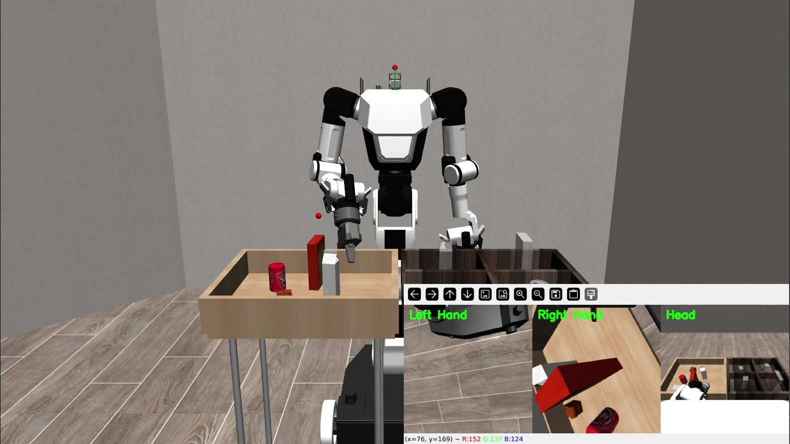
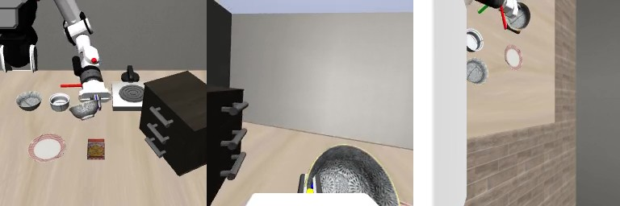

# RBY1 Robot Integration for LIBERO Benchmark

> ⚠️ **Work In Progress (개발 중)**  
> This project is currently under active development. Features may be incomplete or change without notice.  
> 이 프로젝트는 현재 개발 중입니다. 기능이 불완전하거나 예고 없이 변경될 수 있습니다.

This repository contains the integration of the **RBY1 v1.1 humanoid robot** into the **LIBERO benchmark** environment for evaluating Vision-Language-Action (VLA) models, specifically **MolmoAct**.

## Overview

<p align="center">
  <strong>Robosuite</strong><br>
  <br><br>
  <strong>LIBERO</strong><br>
  
</p>

This project adapts the [MolmoAct](https://github.com/allenai/MolmoAct) VLA model (originally trained on Panda robot) to work with the RBY1 humanoid robot in the [LIBERO](https://github.com/Lifelong-Robot-Learning/LIBERO) simulation environment built on [robosuite](https://github.com/ARISE-Initiative/robosuite).

### Key Features
- **6 robot variants** — Full body, fixed lower body, both arms, right arm, left arm, legacy single-arm
- **Visual gripper meshes** — Realistic EE_BODY + EE_FINGER rendering (not just collision boxes)
- **Static EE visuals** — Non-gripper arms display visual end-effector bodies
- **OSC_POSE controller** — Cartesian delta control optimized for table-top manipulation
- **LIBERO compatibility** — Backward-compatible `RBY1Single` alias, table offset presets
- **Automatic setup script** — One-command installation into any robosuite

## Robot Variants

| Variant | Active Parts | Controller | Use Case |
|---------|-------------|-----------|----------|
| `RBY1` | Wheels + Torso + Both Arms + Head | JOINT_POSITION | Full-body research |
| `RBY1FixedLowerBody` | Torso + Both Arms + Head | JOINT_POSITION | Upper-body manipulation |
| `RBY1BothArms` | Both Arms only | OSC_POSE (x2) | Bimanual tasks |
| `RBY1RightArm` | Right Arm only | OSC_POSE | Single-arm tasks |
| `RBY1LeftArm` | Left Arm only | OSC_POSE | Single-arm tasks |
| `RBY1Single` | = `RBY1RightArm` alias | OSC_POSE | LIBERO backward compat |

## Quick Start

### Installation

1. **Install robosuite** (if not already installed):
```bash
pip install robosuite==1.5.2
```

2. **Clone and install RBY1:**
```bash
git clone https://github.com/inha-united-athome/rby1_LIBERO.git
cd rby1_LIBERO
python setup_robosuite.py
```

The setup script automatically:
- Copies robot model, gripper, meshes, and controller configs
- Patches `__init__.py` registration files
- Patches `manipulator_model.py` for left-arm support

To install into a specific robosuite path (e.g., a virtualenv):
```bash
python setup_robosuite.py --path /path/to/venv/lib/python3.10/site-packages/robosuite
```

### Basic Example
```python
import robosuite as suite

# Create environment with RBY1 right arm
env = suite.make(
    env_name="Lift",
    robots="RBY1RightArm",     # or "RBY1Single" for LIBERO compat
    has_renderer=True,
    has_offscreen_renderer=False,
    use_camera_obs=False,
)

obs = env.reset()
for _ in range(100):
    action = env.action_space.sample()
    obs, reward, done, info = env.step(action)
    env.render()
env.close()
```

### All Variants
```python
import robosuite as suite

# Single-arm variants (FixedBaseRobot, OSC_POSE)
for robot in ["RBY1RightArm", "RBY1LeftArm", "RBY1Single"]:
    env = suite.make("Lift", robots=robot)
    env.reset()
    print(f"{robot}: action_dim={env.action_spec[0].shape}")
    env.close()

# Both arms (FixedBaseRobot, OSC_POSE x 2)
env = suite.make("Lift", robots="RBY1BothArms")
env.reset()
print(f"BothArms: action_dim={env.action_spec[0].shape}")
env.close()

# Full body (LeggedRobot, JOINT_POSITION)
env = suite.make("Lift", robots="RBY1")
env.reset()
print(f"Full RBY1: action_dim={env.action_spec[0].shape}")
env.close()
```

## Project Structure

```
rby1_LIBERO/
├── setup_robosuite.py                          # Auto-install script
├── test_rby1_robosuite.py                      # Visual test demo
├── robosuite/                                  # RBY1 files for robosuite
│   └── robosuite/
│       ├── controllers/config/robots/
│       │   ├── default_rby1_single.json        # OSC_POSE (single/both-arms)
│       │   └── default_rby1.json               # JOINT_POSITION (full body)
│       ├── models/
│       │   ├── robots/manipulators/
│       │   │   └── rby1_robot.py               # All 6 variant classes
│       │   ├── grippers/
│       │   │   └── rby1_gripper.py             # Gripper Python class
│       │   └── assets/
│       │       ├── robots/rby1/
│       │       │   ├── robot.xml               # Main MJCF model (~1985 lines)
│       │       │   └── meshes/*.obj            # Robot link meshes
│       │       └── grippers/
│       │           ├── rby1_gripper.xml        # Gripper MJCF
│       │           └── meshes/rby1_gripper/    # Gripper visual meshes
├── experiments/
│   ├── libero/
│   │   ├── rby1_libero_eval.py                 # LIBERO evaluation script
│   │   └── rby1_libero_utils.py                # Utilities
│   └── LIBERO/                                 # LIBERO benchmark
└── rby1a/
    └── mujoco/                                 # Original RBY1 MuJoCo assets
```

## RBY1 Robot Configuration

### Initial Joint Configuration (init_qpos)
Optimized so the gripper points downward (matching Panda EEF orientation):

```python
# Target: EEF Euler ~ [0, 7, 0] degrees (gripper pointing down)
RIGHT_ARM_QPOS = [-0.35, -0.60, -1.10, -1.00, -3.00, -1.74, -2.00]
LEFT_ARM_QPOS  = [-0.35,  0.60,  1.10, -1.00,  3.00, -1.74,  2.00]
```

### Joint Definitions
| Joint | Name | Function | Limits (rad) |
|-------|------|----------|--------------|
| arm_0 | Shoulder Yaw | Y-axis positioning | [-2.356, 2.356] |
| arm_1 | Shoulder Pitch | Up/Down movement | [-3.142, 0.050] |
| arm_2 | Shoulder Roll | Arm rotation | [-2.094, 2.094] |
| arm_3 | Elbow | Arm flexion | [-2.618, 0.010] |
| arm_4 | Wrist Roll | Gripper roll | [-6.283, 6.283] |
| arm_5 | Wrist Pitch | Gripper direction | [-1.745, 2.007] |
| arm_6 | Wrist Yaw | Gripper yaw | [-2.967, 2.967] |

### OSC Controller Configuration
```json
{
    "type": "OSC_POSE",
    "input_type": "delta",
    "input_ref_frame": "base",
    "output_max": [0.05, 0.05, 0.05, 0.5, 0.5, 0.5],
    "kp": [500, 500, 500, 500, 500, 500]
}
```

## Usage

### Running Evaluation

**Evaluate RBY1 on LIBERO Spatial:**
```bash
cd experiments/libero
export PYTHONPATH=$PWD/../LIBERO:$PWD/../../robosuite:$PYTHONPATH
export HF_HOME=~/molmoact_data/huggingface

python rby1_libero_eval.py \
    --task spatial \
    --task_id 0 \
    --checkpoint allenai/MolmoAct-7B-D-LIBERO-Spatial-0812
```

**Available task suites:**
- `spatial` - Spatial reasoning tasks
- `object` - Object manipulation tasks
- `goal` - Goal-oriented tasks
- `10` - 10-task benchmark

### Visual Test
```bash
DISPLAY=:1 python test_rby1_robosuite.py
```

## Technical Details

### Key Modifications from Original robosuite

1. **Robot Base Positioning** — Table-type-aware offsets for LIBERO environments
2. **Transparent Collision Geoms** — `contact_geom_rgba = [0, 0, 0, 0]` prevents green collision overlay
3. **Static EE Visuals** — Non-gripper arms show visual-only end-effector bodies
4. **Left-Arm Mapping** — Physical left arm mapped to robosuite `arms=["right"]` slot
5. **ManipulatorModel Patch** — `getattr(self.__class__, "arms", ["right"])` for custom arm support

## Current Status & Known Issues

### Completed
- RBY1 v1.1 full robot model with 6 variants
- OSC_POSE controller configuration
- Visual gripper meshes (EE_BODY + EE_FINGER)
- Static EE visuals for non-gripper arms
- LIBERO environment adaptation
- Automatic setup script

### In Progress
- VLA model fine-tuning for RBY1
- Task success rate evaluation
- Gripper action calibration

### Known Issues
- First few steps may show delta=0 (OSC controller stabilization)
- Some LIBERO tasks may require additional init_qpos tuning
- Gripper timing differences from Panda

## References

- **MolmoAct:** https://github.com/allenai/MolmoAct
- **LIBERO:** https://github.com/Lifelong-Robot-Learning/LIBERO
- **robosuite:** https://github.com/ARISE-Initiative/robosuite
- **RBY1 SDK:** https://github.com/RainbowRobotics/rby1-sdk

## License

Based on:
- MolmoAct: Apache 2.0 License
- LIBERO: MIT License
- robosuite: MIT License
